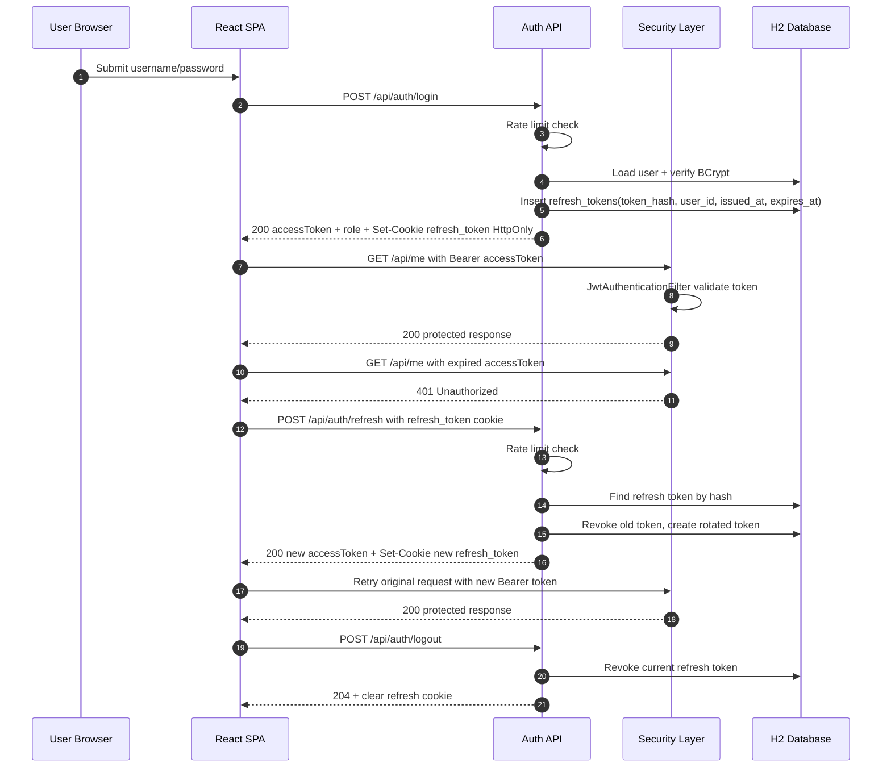

# Phase 1 Design - Security Spring Training Lab

## Scope Snapshot

- Fullstack: Spring Boot backend + React frontend.
- Storage: H2 for local iteration.
- Auth model: JWT access token (15m) + DB-backed refresh token (7d).
- Refresh transport: HttpOnly cookie.
- RBAC: USER and ADMIN only.
- Admin scope: user list, lock/unlock, session revoke, audit logs.
- Exclusions: no OAuth2/OIDC, no mobile flows, no email verification, no password reset.

## 1. Architecture Summary

### Backend layer map

- controller: request/response contracts and route mapping.
- dto: transport models for API payloads.
- service: auth/session/admin business logic.
- repository: JPA persistence boundaries.
- entity: User, RefreshToken, AuditLog domain tables.
- config/security: SecurityFilterChain, JWT filter, security headers, rate limit, OpenAPI.
- exception: stable auth and domain error responses.

### Frontend layer map

- API client: axios instance with bearer attach + one-time refresh retry.
- Auth state: in-memory access token, role, username.
- Route guards: auth required for user routes, ADMIN required for admin routes.
- Pages: login, me profile/status, admin users, admin audit logs, unauthorized.

### Security building blocks

- SecurityFilterChain enforces:
  - public: /api/auth/**, swagger, h2-console, health.
  - admin only: /api/admin/**.
  - authenticated: everything else.
- JwtAuthenticationFilter parses Bearer token, validates JWT, sets SecurityContext.
- JwtTokenService issues and validates access JWT.
- AuthExceptionHandler returns consistent 401/403 JSON.
- BCrypt password hashing validates login credentials.
- Bucket4j rate limiting protects /api/auth/login and /api/auth/refresh.
- SecurityHeadersFilter applies browser hardening headers for local web usage.

### Trust boundaries

1. Browser runtime boundary: JS can access only in-memory access token; refresh cookie is HttpOnly.
2. Frontend to backend API boundary: CORS + credentials + bearer token for protected calls.
3. API to database boundary: JPA repositories, no direct DB access from controllers.
4. Admin privilege boundary: enforced both by URL policy and @PreAuthorize checks.

## 2. Auth and Session Flow Narrative

### Login flow

1. User posts credentials to POST /api/auth/login.
2. Rate limiter validates caller budget.
3. Backend validates username/password with BCrypt.
4. Backend denies locked or disabled users.
5. Backend mints access JWT (15m).
6. Backend creates refresh token record with:
   - random raw token generated server-side,
   - SHA-256 hash stored in DB (not raw token),
   - issuedAt/expiresAt/revokedAt metadata.
7. Backend sets refresh token in HttpOnly cookie on /api/auth path.
8. Backend returns access token + role in response body.
9. Audit event LOGIN is written with SUCCESS/FAILURE.

### Authenticated request flow

1. Frontend sends Authorization: Bearer <accessToken>.
2. JwtAuthenticationFilter validates token and sets principal + ROLE_* authority.
3. SecurityFilterChain applies route rules and role checks.
4. Controller handles request only when auth and authorization pass.

### Refresh rotation flow

1. Frontend receives 401 on protected request.
2. Axios interceptor calls POST /api/auth/refresh once.
3. Rate limiter validates caller budget.
4. Backend reads refresh_token from HttpOnly cookie.
5. Backend hashes incoming raw refresh token and loads DB record.
6. Backend rejects if token missing, expired, or revoked.
7. Backend mints new refresh token record and new access token.
8. Backend marks old refresh token revokedAt and replacedByTokenId.
9. Backend sets new refresh cookie and returns new access token.
10. Frontend retries original request exactly once with new bearer token.

### Logout flow

1. Frontend calls POST /api/auth/logout.
2. Backend revokes matching refresh token if present.
3. Backend clears refresh_token cookie (Max-Age=0).
4. Audit event LOGOUT is written.

### Admin security action flow

1. ADMIN calls lock/unlock/revoke endpoint.
2. Backend enforces ADMIN role.
3. User state or refresh token states are updated.
4. Audit event LOCK_USER/UNLOCK_USER/REVOKE_SESSIONS is written.

## 3. Schema Summary

### users

- id (PK)
- username (unique, not null)
- password (BCrypt hash, not null)
- role (enum USER|ADMIN, not null)
- locked (boolean, not null)
- enabled (boolean, not null)
- created_at (timestamp, not null)

### refresh_tokens

- id (PK)
- token_hash (unique, not null)
- user_id (FK -> users.id, not null)
- issued_at (timestamp, not null)
- expires_at (timestamp, not null)
- revoked_at (timestamp, nullable)
- replaced_by_token_id (nullable self-reference marker)

### audit_logs

- id (PK)
- event_type (not null)
- actor (not null)
- target (nullable)
- timestamp (not null)
- result (not null)
- details (nullable)

### Relational notes

- One user has many refresh token records over time.
- One user can have many audit events as actor or target.
- Rotation chain is represented by replaced_by_token_id and revoked_at.

## 4. Flow Diagram (Mermaid)



## 5. Schema Diagram (Mermaid)

```mermaid
erDiagram
    USERS ||--o{ REFRESH_TOKENS : owns

    USERS {
        BIGINT id PK
        STRING username UNIQUE
        STRING password
        STRING role
        BOOLEAN locked
        BOOLEAN enabled
        TIMESTAMP created_at
    }

    REFRESH_TOKENS {
        BIGINT id PK
        STRING token_hash UNIQUE
        BIGINT user_id FK
        TIMESTAMP issued_at
        TIMESTAMP expires_at
        TIMESTAMP revoked_at
        BIGINT replaced_by_token_id
    }

    AUDIT_LOGS {
        BIGINT id PK
        STRING event_type
        STRING actor
        STRING target
        TIMESTAMP timestamp
        STRING result
        STRING details
    }
```

## 6. Phase 1 Acceptance Criteria

- Token model and TTL are explicit and consistent across frontend/backend.
- Trust boundaries and role boundaries are documented.
- Refresh rotation and revocation mechanics are documented.
- Core threat categories and mitigations are recorded.
- Non-goals are documented to avoid scope creep in later phases.
